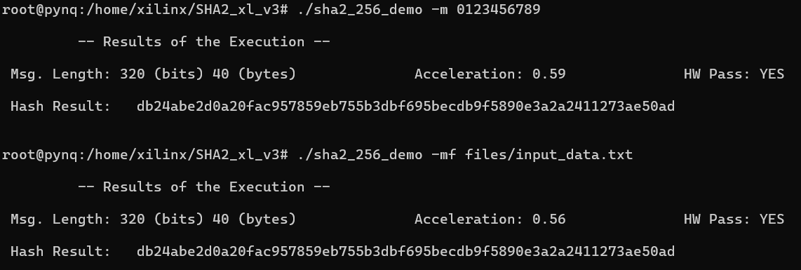

# SHA2 HW IP module

2024-03-11 - Eros Camacho-Ruiz (camacho@imse-cnm.csic.es)

This is the repository of the evaluation carried out in the SHA2 section presented in the [PhD Dissertation](https://github.com/ErosCamacho/PhD_Dissertation/blob/main/PhD_Thesis_Eros_Camacho_Ruiz_vFinal_rev.pdf) entitled: <b>"Design of a hardware Root-of-Trust on embedded systems"</b>

The main idea of this repository is, following the standard FIPS 198-4:
- Present the IP Module developed in the context of the dissertation. 
- Present an extensible test functionality in which the NIST Tests Vector have been validated. 
- Define a demo for the modules presented.

*Note: All the content of this repository has been implemented using the Pynq Framework.*

<!-- TABLE OF CONTENTS -->
## Table of Contents
  <ol>
    <li><a href="#dir-struc">Directory structure</a></li>
    <li><a href="#ip-integ">IP Integration</a></li>
    <li><a href="#pre-pynqz2">Prerequisites for the Pynq-Z2 platform</a></li>
    <li><a href="#ins-test">Installation and Use of the Test</a></li>
	<li><a href="#ins-demo">Installation and Use of the Demo</a></li>
	<li><a href="#example">Example of the Demo</a></li>
    <li><a href="#note">Note for version</a></li>
    <li><a href="#contact">Contact</a></li>
	<li><a href="#developers">Developers</a></li>
  </ol>

## Directory structure <a name="dir-struc"></a>

- sha2_xl_3_0: the IP module of the SHA3/SHAKE algorithm.
- SHA2_xl_v3: the folder that contains the software implementation and the HW call drivers.
    - files: this folder contains the files to be parsed in the demo of the SHA2.
	- NIST_TestVector: the NIST Test Vector for SHA2.
    - sha2: this folder contains all the files to implement and use the SHA2 either in HW and SW version.
    - sha2_test.c: main file to sha2 tests
	- sha2_demo.c: main file to sha3 demo
    - Makefile: to generate the executables for the library
- README.md: this file 

## IP Integration <a name="ip-integ"></a>

The IP module is delivered in the ```sha2_xl_3_0``` folder. 
The design of the core part of the IP module is depicted in the next figure.
The Message Schedule is based on a Linear Feedback Register (LFSR) that feeds the Arithmetic Unit. The core of the SHA2 performs the operation in each cycle in which it is used the correspond value of _K_. 


The IP integration is finished adding an user interface in which it is possible to modify the next parameters of module:
- ```Version```: selection of the algorithm of SHA2 that are compiled in the FIPS 198-4. 


For further information, see Chapter 3 of the [PhD Dissertation](https://github.com/ErosCamacho/PhD_Dissertation/blob/main/PhD_Thesis_Eros_Camacho_Ruiz_vFinal_rev.pdf)

## Prerequisites for the Pynq-Z2 platform <a name="pre-pynqz2"></a>

1. Download the PYNQ C-API from https://github.com/mesham/pynq_api

2. Then, issue ```make```. Once it is built, issue ```sudo make install```. 

## Installation and Use of the Test <a name="ins-test"></a>

The Test section performs the NIST Test Vector of each algorithm. 

1. For compilation of a specific test for sha2:

```bash
make sha2_XXX_test
```

where `XXX` can be: `224, 256, 384, 512, 512_224, 512_256`. So, for example if the user wants to compile the case of sha2-256, 
they must issue: `make sha2_256_test`

2. For the use, the program has different input variables:
	- `-h` : Show the help.
	- `-hh` : Show the extended help.
	- `-v` : Verbose Level:
		- `1`: Show the Acceleration of each NIST run (By default).
		- `2`: Show the Acceleration + Output Data of each NIST run.
		- `3`: Show the Acceleration + Input/Output Data of each NIST run.
	- `-b` : Selection of NIST Bit Test.
		- `1`: Use the NIST Byte Test **(By default)**.
		- `2`: Use the NIST Bit Test. ***WARNING: The reference SW is not prepared for this test.***
	- `-n` : [Number] of test executions.
	- `-s` : Stop in each run.
	- `-i` : Select de initial value for the sample run. **It is not mandatory**
	- `-f` : Select de final value for the sample run. **It is not mandatory**

An example, if it is desired to performance 10 tests on the sha2-256, using the NIST Byte Test and those tests between 10 and 20, it has to be typed: `sha2_256_test -n 10 -b 1 -i 10 -f 20`.

## Installation and Use of the Demo <a name="ins-demo"></a>

The main idea of the Demo is to use the hardware implementations in real use of cases. For that it has been given the option to input either a prompt message or a file in ASCII format or hexadecimal format. 

1. For compilation of a specific demo for sha3:

```bash
make sha2_XXX_demo
```

where `XXX` can be: `224, 256, 384, 512, 512_224, 512_256`. So, for example if the user wants to compile the case of sha2-256, 
they must issue: `make sha2_256_demo`

2. For the use, the program has different input variables:
	- `-h` : Show the help.
	- `-v`: Verbose Level:
		- `1`: Show the Acceleration (By default).
		- `2`: Show the Acceleration + Output Data.
		- `3`: Show the Acceleration + Input/Output Data.
	- `-m`: Input message (HEX format).
	- `-t`: Input message (TXT format).
	- `-mf`: Input HEX file [file name].
	- `-tf`: Input TXT file [file name].

The results of the demo can also be checked in: https://emn178.github.io/online-tools/sha256.html.

## Example of the Demo <a name="example"></a>

There are several use of case of this demo, but in general it is going to be used to hash an input text in hex format and a file.

1. So, for example if the message `0x0123456789` is going to be hashed using the sha2-256
```bash
./sha2_256_demo -m 0123456789
```

2. In this case if it is the content of a file (in hexadecimal) what is going to be hashed: 
```bash
./sha2_256_demo -mf files/input_data.txt
```

The execution of both examples can be shown in the next figure:



## Note for version <a name="note"></a>
### v. 1.0

* Reordered the repository structure.
* Added a Readme file. 

## Contact <a name="contact"></a>

**Eros Camacho-Ruiz** - (camacho@imse-cnm.csic.es)

_Hardware Cryptography Researcher_ 

_Instituto de Microelectrónica de Sevilla (IMSE-CNM), CSIC, Universidad de Sevilla, Seville, Spain_

## Developers <a name="developers"></a>
Eros Camacho-Ruiz

_Instituto de Microelectrónica de Sevilla (IMSE-CNM), CSIC, Universidad de Sevilla, Seville, Spain_


